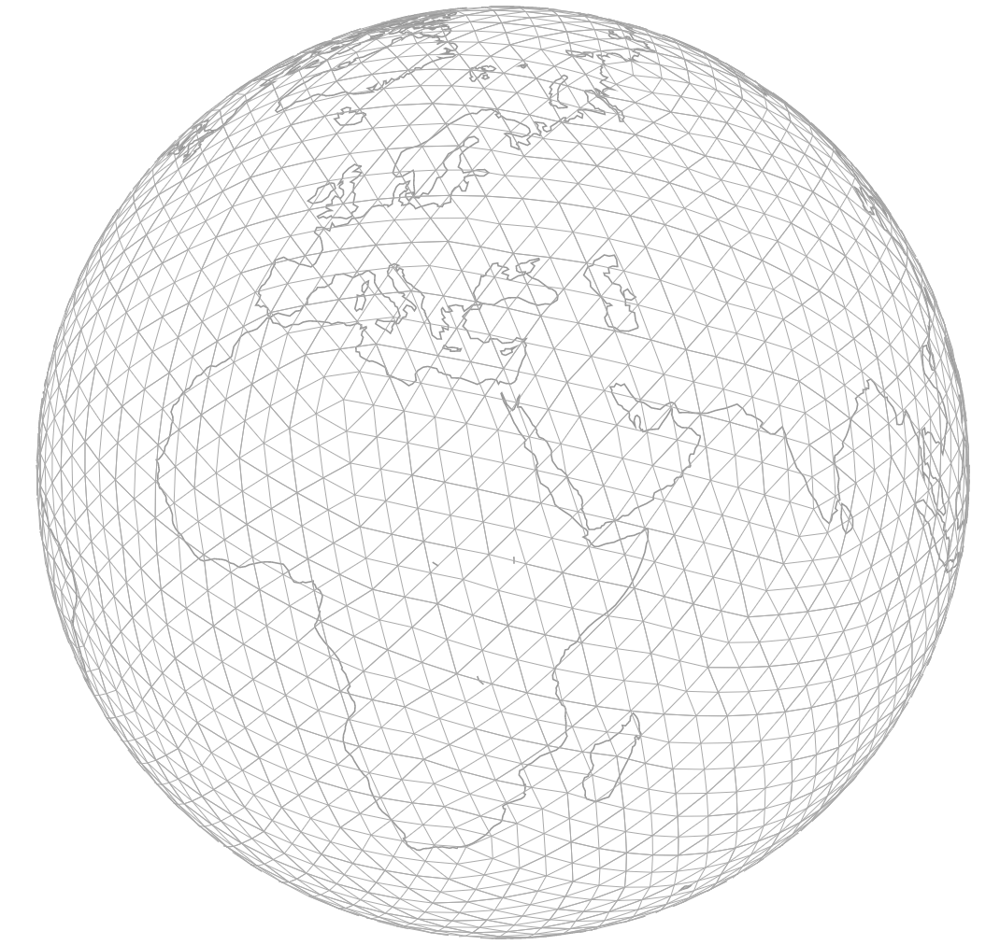

# Myriahedron

Tools for projecting spatial data onto a Myriahedron.



Buckminster Fuller's [Dymaxion map](https://en.wikipedia.org/wiki/Dymaxion_map) is a famous example of a projection that manages to preserve area and shape by projecting the globe onto the surface of an icosahedron.  By dividing the globe into 20 equal-area triangles, it also succeeds in being the basis for an effective binning strategy to visualize large datasets.  Recursively subdividing each of the 20 original triangles produces a [geodesic polyhedron](https://en.wikipedia.org/wiki/Geodesic_polyhedron) or [myriahedron](https://www.win.tue.nl/~vanwijk/myriahedral/), or a triagle-based grid of arbitrary precision (and incidentally produces something similar to a [geodesic dome](https://en.wikipedia.org/wiki/Geodesic_dome), another of Buckminster Fuller's projects).

Because each triangle is equal in area to all other triangles of the same depth, myriahedral grids have an obvious benefit over square grids, which become distorted as they near the poles.  Despite this distortion, aggregating datasets to a square bin is more computationally efficient, leading to a trade off between accuracy and efficiency


To generate a geoJSON myriahedron of depth `<n>`

```bash
node myriahedron.js <n> ./data/myriahedron-1.json
```

To generate a topoJSON myriahedron of depth `<n>`, pipe the output to [`geo2topo`](https://github.com/topojson/topojson-server/blob/master/README.md#geo2topo)

```bash
node myriahedron.js <n> ./data/myriahedron-1.json | geo2topo
```

To generate a topoJSON topology of multiple myriadrons of differing depths

```bash
node lib/topojsonize <myriahedron-1> [<myriahedron-2> ...]
```

### See Also
* [Myriahedral Projection](https://www.win.tue.nl/~vanwijk/myriahedral/)
* [Yin-Yang Grid](http://www.mpa-garching.mpg.de/184309/Yin-Yang)
* [Quad Sphere](https://en.wikipedia.org/wiki/Quadrilateralized_spherical_cube)
* [Spherical Geodesic Grids](http://kiwi.atmos.colostate.edu/BUGS/geodesic/)
* [Variable-Size Grids](http://mpas-dev.github.io/)
* [Generate Icosahedron Points on Globe](http://montalk.net/coordinates.htm)
